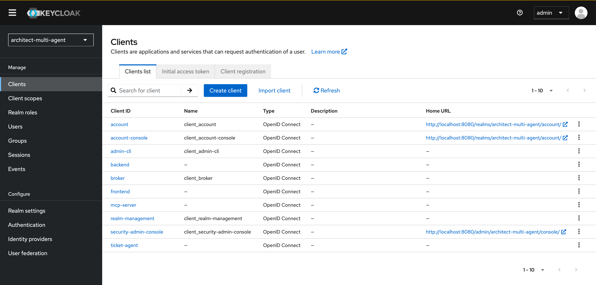
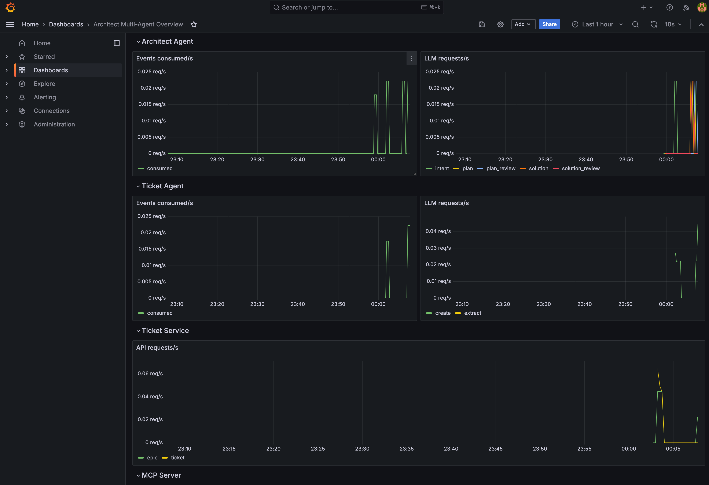
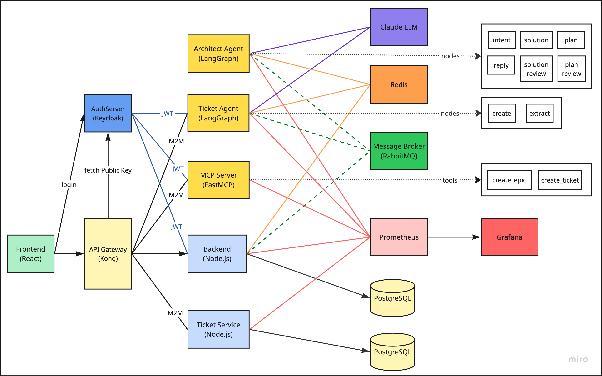

# Architect Agent

A **multi-agent AI** system for software architecture planning. Describe a requirement — _"implement an SFTP solution"_ — and a pipeline of specialised AI agents collaborates to produce a solution architecture and development tickets. An approval-loop graph designs and reviews the plan; a separate tool-calling agent persists it as an epic and tickets via MCP. Review the plan, refine it with follow-ups, or accept it to trigger ticket creation.






---

## Architecture



The system is composed of ten services communicating over HTTP, WebSocket, RabbitMQ, and Redis. All external and internal HTTP traffic flows through **Kong API Gateway**. Authentication is centralised in **Keycloak**: service-to-service calls use OAuth 2.0 Client Credentials tokens; browser users log in via OpenID Connect (OIDC) Authorization Code Flow with PKCE. Kong validates all JWTs at the gateway before forwarding requests — services trust what Kong passes through.

```
┌─────────────────────────────────────────────────────────────────────┐
│  Browser                                                            │
│  Next.js frontend  (port 3000)                                      │
│  · Requirement input, live thinking log, plan card, final reply     │
│  · "Looks good" button → accept flow; free-text → refine flow       │
│  · Sidebar with conversation history (scoped to logged-in user)     │
│  · /epic/:id and /ticket/:id detail pages                           │
│  · Keycloak login — OIDC Authorization Code Flow + PKCE             │
└──────────────────────┬───────────────────────┬──────────────────────┘
                       │ HTTP  /api/*           │ WS  /ws
                       │ (Next.js proxy)        │ (direct WebSocket)
┌──────────────────────▼───────────────────────▼──────────────────────┐
│  Kong API Gateway  (port 8888 external · 8000 internal)             │
│  · JWT plugin — validates kc_token cookie (browser users) or        │
│    Authorization: Bearer (M2M services) against Keycloak RS256 key  │
│  · Rate-limiting — 100 req/min per IP (all routes)                  │
│  · Routes (strip_path: true):                                        │
│      /backend        → backend:8000                                  │
│      /ticket-service → ticket-service:8000                           │
│      /ticket-agent   → ticket-agent:8000                             │
│      /mcp-server     → mcp-server:8000                               │
└──────────────────────┬───────────────────────────────────────────────┘
                       │ strips prefix, forwards verified request
┌──────────────────────▼──────────────────────────────────────────────┐
│  Backend  (NestJS · port 8000)                                      │
│  · REST chat API — saves username per conversation                  │
│  · Ticket proxy — forwards to ticket-service via Kong               │
│  · WebSocket gateway — polls Redis, pushes chat-update events       │
│  · PostgreSQL — conversations (uuid, username, title, messages)     │
│  · Redis       — live chat state during agent processing            │
│  · Publishes ChatEventInterface to RabbitMQ (fire-and-forget)       │
│  · Decodes kc_token cookie (Kong-verified) to populate req.user     │
└────────────┬─────────────────────────────┬───────────────────────────┘
             │ AMQP publish                │ read / write
             │ architecture-agent.chat     │
┌────────────▼──────────────────────┐   ┌──▼──────────────────────┐
│  RabbitMQ                         │   │  Redis                   │
│  queues:                          │   │  key: chat:{uuid}        │
│  · architecture-agent.chat        │   │  key: mcp_tools          │
│  · architecture-agent.accept      │   └──────────────────────────┘
└────────────┬──────────────────────┘
             │ AMQP subscribe (architecture-agent.chat)
┌────────────▼────────────────────────────────────────────────────────┐
│  Architect Agent  (FastAPI + LangGraph · port 8001)                 │
│                                                                     │
│  START → intent_node                                                │
│              │                                                      │
│    ┌─[plan/refine]──────────────────────────────────┐               │
│    │                                                ▼               │
│    │                                   ┌─► solution_node            │
│    │                                   │        │                   │
│    │                                   │        ▼                   │
│    │                          [rejected]│ solution_review_node      │
│    │                                   └───┘    │ [approved]        │
│    │                                            ▼                   │
│    │                                   ┌─► plan_node                │
│    │                                   │        │                   │
│    │                          [rejected]│ plan_review_node          │
│    │                                   └───┘    │ [approved]        │
│    │                                            ▼                   │
│    │                                       reply_node → END         │
│    │                                                                 │
│    └─[accept]──► publish AcceptEvent ──► END                        │
│                          │                                          │
└──────────────────────────┼──────────────────────────────────────────┘
                           │ AMQP publish (architecture-agent.accept)
┌──────────────────────────▼──────────────────────────────────────────┐
│  Ticket Agent  (FastAPI + LangGraph · StateGraph · port 8004)       │
│                                                                     │
│  START → create_node ◄──────────────┐                               │
│              │                      │                               │
│    ┌─[tool calls]──► tools_node ────┘                               │
│    │                                                                 │
│    └─[done]──► extract_node → END                                   │
│                                                                     │
│  · Fetches Keycloak token (Client Credentials) before MCP calls     │
│  · MCP calls routed through Kong (/mcp-server)                      │
└────────────┬────────────────────────────────────────────────────────┘
             │ MCP via Kong (http://kong:8000/mcp-server/mcp/)
             │ Bearer <Keycloak M2M token>
┌────────────▼──────────────────────────┐  ┌───────────────────────┐
│  MCP Server  (port 8002)              │  │  Keycloak (port 8080) │
│  create_epic / create_ticket          │  │                       │
│  · Fetches Keycloak token before      │  │  realm:               │
│    calls to ticket-service via Kong   │  │  architect-multi-agent│
└────────────┬──────────────────────────┘  │                       │
             │ REST via Kong               │  M2M clients:         │
             │ (/ticket-service/api/*)     │  · ticket-agent       │
             │ Bearer <Keycloak M2M token> │  · mcp-server         │
┌────────────▼──────────────────────────┐  │  · backend            │
│  Ticket Service  (port 8003)          │  │                       │
│  NestJS — epic + ticket CRUD          │  │  OIDC clients:        │
│  · PostgreSQL                         │◄─┤  · frontend           │
│  · Trusts Kong JWT validation         │  └───────────────────────┘
└───────────────────────────────────────┘
```

---

## Services

| Service | Port | Directory | Stack |
|---------|------|-----------|-------|
| frontend | 3000 | `frontend/` | Next.js 16 · React 19 · Tailwind CSS 4 · keycloak-js |
| backend | 8000 | `backend/` | NestJS 11 · TypeORM · PostgreSQL · Redis · RabbitMQ |
| architect-agent | 8001 | `architect-agent/` | FastAPI · LangGraph · LangChain · Claude |
| mcp-server | 8002 | `mcp-server/` | FastMCP · FastAPI |
| ticket-service | 8003 | `ticket-service/` | NestJS 11 · TypeORM · PostgreSQL |
| ticket-agent | 8004 | `ticket-agent/` | FastAPI · LangGraph · StateGraph · Claude |
| kong | 8888 | `kong/` | Kong 3.8 (DB-less) |
| rabbitmq | 5672 / 15672 | — | RabbitMQ 3 |
| redis | 6379 | — | Redis 7 |
| postgres-backend | 5432 | — | PostgreSQL 17 |
| postgres-tickets | 5433 | — | PostgreSQL 17 |
| keycloak | 8080 | `keycloak/` | Keycloak 26 |
| prometheus | 9090 | `prometheus/` | Prometheus v2.53 |
| grafana | 3001 | `grafana/` | Grafana 11.1 |

---

## Kong API Gateway

Kong runs in DB-less mode with a declarative configuration generated at startup. The `kong/entrypoint.sh` script fetches Keycloak's RSA public key once at boot and writes the full config to `/tmp/kong.yml`, then starts Kong.

### Routing

All four application services are registered as Kong upstreams with `strip_path: true`:

| External path | Upstream |
|---|---|
| `http://localhost:8888/backend/*` | `backend:8000/*` |
| `http://kong:8000/ticket-service/*` | `ticket-service:8000/*` |
| `http://kong:8000/ticket-agent/*` | `ticket-agent:8000/*` |
| `http://kong:8000/mcp-server/*` | `mcp-server:8000/*` |

The frontend accesses Kong on port 8888. All inter-service (east-west) calls use the internal Docker address `http://kong:8000` — no service hardcodes another service's hostname.

### JWT validation

Kong verifies every request locally using the embedded Keycloak RS256 public key — no call to Keycloak per request. Two consumers cover both token types:

| Consumer | `iss` claim | Token source |
|---|---|---|
| `browser-user` | `http://localhost:8080/realms/architect-multi-agent` | `kc_token` cookie (browser login) |
| `service-account` | `http://keycloak:8080/realms/architect-multi-agent` | `Authorization: Bearer` (M2M) |

### Rate limiting

A global rate-limiting plugin caps all routes at **100 requests per minute per IP** (`policy: local`). Every response includes `X-RateLimit-Limit-Minute` and `X-RateLimit-Remaining-Minute` headers.

---

## Authentication

All authentication is handled by **Keycloak** (port 8080, realm `architect-multi-agent`), configured via `keycloak/realm.json` which is auto-imported on first startup.


### Service-to-service: OAuth 2.0 Client Credentials + `private_key_jwt`

Each M2M service (ticket-agent, mcp-server, backend) authenticates to Keycloak using the **Client Credentials** grant with **`private_key_jwt`** client authentication (RFC 7523). Rather than a shared secret, each service signs a short-lived JWT assertion with its own RSA-2048 private key. Keycloak fetches the service's own JWKS endpoint to validate the assertion, then issues a 30-minute RS256 access token.

Each service:
- Holds its RSA-2048 private key in `.env` as `PRIVATE_KEY_PEM`
- Serves the corresponding public key as a JWK at `GET /api/.well-known/jwks` (via `JwksService`)
- Signs a client assertion JWT (`iss=clientId`, `sub=clientId`, `aud=tokenUrl`, unique `jti`, 30-minute `exp`) with RS256
- Posts the assertion to Keycloak's token endpoint as `client_assertion_type=urn:ietf:params:oauth:client-assertion-type:jwt-bearer`
- Caches the resulting access token in memory (30-minute TTL); refreshes 30 seconds before expiry

Keycloak clients are configured with `"clientAuthenticatorType": "client-jwt"` and `"use.jwks.url": "true"` pointing to each service's `/api/.well-known/jwks` endpoint.

**Token validation is handled by Kong**, not by the receiving services. Kong's JWT plugin verifies the RS256 signature locally using Keycloak's public key fetched once at startup. Services behind Kong trust that any forwarded request carries a valid token.

#### Authentication map

| Caller | Kong route | Recipient | Token source |
|--------|-----------|-----------|-------------|
| ticket-agent | `/mcp-server` | mcp-server | Keycloak — `ticket-agent` client credentials |
| mcp-server | `/ticket-service` | ticket-service | Keycloak — `mcp-server` client credentials |
| backend | `/ticket-service` | ticket-service | Keycloak — `backend` client credentials |

### Frontend user authentication: OIDC Authorization Code Flow with PKCE

The frontend uses `keycloak-js` with `onLoad: 'login-required'` and `pkceMethod: 'S256'`. On first load, unauthenticated users are redirected to Keycloak's login page. After a successful login, the access token is stored in a `kc_token` cookie. Kong validates this cookie on every request to `/backend`. The backend's `KeycloakAuthMiddleware` then simply decodes the already-verified token (no JWKS fetch) to populate `req.user` with the username and email.

The authenticated username is stored on the `conversations` table when a new chat is created, and used to scope the chat history endpoint (`GET /api/chat/history`) so each user only sees their own conversations.

---

## Observability


Prometheus (port 9090) scrapes all five application services every 15 seconds. Grafana (port 3001, login `admin`/`admin`) is pre-provisioned with a Prometheus datasource and an overview dashboard.

### Metrics per service

| Service | Metric | Description |
|---------|--------|-------------|
| backend | `backend_chat_requests_total{endpoint}` | Requests to `/api/chat/new` and `/api/chat/:id/cont` |
| backend | `backend_events_published_total` | Events published to RabbitMQ |
| architect-agent | `architect_agent_events_consumed_total` | RabbitMQ messages consumed |
| architect-agent | `architect_agent_llm_requests_total{node}` | LLM calls per graph node |
| ticket-agent | `ticket_agent_events_consumed_total` | RabbitMQ messages consumed |
| ticket-agent | `ticket_agent_llm_requests_total{node}` | LLM calls per graph node |
| mcp-server | `mcp_server_tool_requests_total{tool}` | MCP tool calls (`create_epic`, `create_ticket`) |
| ticket-service | `ticket_service_requests_total{endpoint}` | Requests to epic and ticket endpoints |

---

## Frontend (port 3000)

- **Keycloak login** — OIDC Authorization Code Flow with PKCE (`keycloak-js`); unauthenticated users are redirected to Keycloak automatically
- User name and email displayed in the sidebar; sign-out button calls `keycloak.logout()`
- Free-text requirement input with live thinking log streamed over WebSocket
- Thinking log shows each agent node's progress: `Analyzing... → Intention: Plan`, `Designing... / Reviewing... → Result: Approved`, etc.
- Approved plan rendered as a `PlanCard` — solution architecture + component list + development tickets
- **"Looks good"** button sends the accept signal; architect-agent publishes an `AcceptEvent` to RabbitMQ; ticket-agent picks it up and calls `create_epic` + `create_ticket` via MCP
- Free-text follow-up refines the plan through a new agent loop
- `FinalReplyCard` fetches the full epic and ticket data from the ticket-service and renders them with clickable links
- **`/epic/:id`** — epic detail page with solution architecture and full ticket list
- **`/ticket/:id`** — ticket detail page with requirements and acceptance criteria
- Left sidebar lists saved conversations scoped to the logged-in user

---

## Backend (port 8000)

### Chat API

| Method | Path | Description |
|--------|------|-------------|
| `POST` | `/api/chat/new` | Create conversation in PostgreSQL + Redis, publish `ChatEvent` to RabbitMQ |
| `POST` | `/api/chat/:id/cont` | Append user message, publish `ChatEvent` to RabbitMQ |
| `GET` | `/api/chat/history` | Return conversations for the logged-in user (id, title, createdAt) |
| `GET` | `/api/chat/:id` | Live state from Redis, or persisted from PostgreSQL |
| `POST` | `/api/chat/:id/stop` | Persist messages to PostgreSQL, delete Redis key |
| `WS` | `/ws` | Polls Redis at 500 ms, pushes `chat-update` events until `agentStatus === hasReplied` |

### Ticket Proxy

Proxies the browser to the internal ticket-service via Kong. Before forwarding, `KeycloakTokenService` obtains a Keycloak access token via the `backend` client credentials and attaches it as `Authorization: Bearer`. Kong validates this M2M token before the request reaches ticket-service.

| Method | Path | Proxies to |
|--------|------|------------|
| `GET` | `/api/epic/:id` | `kong:8000/ticket-service/api/epic/:id` |
| `GET` | `/api/epic/:epicId/tickets` | `kong:8000/ticket-service/api/epic/:epicId/tickets` |
| `GET` | `/api/ticket/:id` | `kong:8000/ticket-service/api/ticket/:id` |

---

## Architect Agent (port 8001)


Consumes `ChatEvent` messages from the `architecture-agent.chat` RabbitMQ queue and runs a **LangGraph** state graph. Each node is a Python class with injected dependencies — a shared `ChatAnthropic` LLM instance and a `RabbitMQPublisher` — wired together in the application container.

### Node responsibilities

| Node | Class | Role |
|------|-------|------|
| `intent_node` | `IntentNode` | Classify user message as `plan`, `refine`, or `accept`; on accept, publish `AcceptEvent` to RabbitMQ |
| `solution_node` | `SolutionNode` | Generate `SolutionInterface` (architecture + components) |
| `solution_review_node` | `SolutionReviewNode` | Approve/reject solution; feed comments back to `solution_node` |
| `plan_node` | `PlanNode` | Break solution into `TicketInterface[]` |
| `plan_review_node` | `PlanReviewNode` | Approve/reject tickets; feed comments back to `plan_node` |
| `reply_node` | `ReplyNode` | Assemble `ReplyInterface` (epic + tickets) and write to Redis |

### Agent internals

Each node's concerns are separated into three dedicated directories:

```
app/agent/
├── nodes/       — node classes (__call__ + private helpers)
├── schemas/     — Pydantic output models (one file per node)
│   ├── intent_schema.py          IntentOut
│   ├── solution_schema.py        SolutionOut, ComponentOut, FeatureOut
│   ├── solution_review_schema.py SolutionReviewOut
│   ├── plan_schema.py            PlanOut, TicketOut, RequirementOut, AcceptanceCriterionOut
│   └── plan_review_schema.py     PlanReviewOut
├── personas/    — LLM role/behaviour system prompts (one file per node)
│   ├── intent_persona.py
│   ├── solution_persona.py
│   ├── solution_review_persona.py
│   ├── plan_persona.py
│   └── plan_review_persona.py
├── templates/   — parameterised user prompt strings (one file per node)
│   ├── intent_templates.py       INTENT_USER
│   ├── solution_templates.py     SOLUTION_USER_NEW / _REFINE / _REVISE
│   ├── solution_review_templates.py SOLUTION_REVIEW_USER
│   ├── plan_templates.py         PLAN_USER / PLAN_USER_REVISE
│   └── plan_review_templates.py  PLAN_REVIEW_USER
└── contracts/   — ArchitectState and shared interfaces
```

### Dependency injection

All nodes receive their dependencies through `__init__`. The application container (`container.py`) constructs and wires everything:

```
Container
  ├── llm                → ChatAnthropic (claude-sonnet-4-6, max_tokens=4096)
  ├── rabbitmq_publisher → RabbitMQPublisher(rabbitmq_url)
  └── agent_graph        → ArchitectGraph(llm, rabbitmq_publisher).build()
```

### State (`ArchitectState`)

```python
class ArchitectState(MessagesState):
    conversation_id: str
    requirement: str
    raw_history: list[dict]
    user_intent: str               # "plan" | "accept" | "refine"
    prior_solution: dict | None    # solution from previous turn (refine context)
    solution: dict | None
    solution_review_comments: list[str]
    solution_approved: bool
    tickets: list[dict]
    ticket_review_comments: list[str]
    tickets_approved: bool
    final_reply: dict | None
```

---

## Ticket Agent (port 8004)


Subscribes to the `architecture-agent.accept` RabbitMQ queue. When an `AcceptEvent` arrives it runs a **LangGraph `StateGraph`** with two nodes: `create_node` (tool-calling loop) and `extract_node` (structured output extraction).

### Graph

```
START → create_node ◄──────────┐
            │                  │
  ┌─[tool calls]──► tools ─────┘
  │
  └─[done]──► extract_node → END
```

| Node | Class | Role |
|------|-------|------|
| `create_node` | `CreateNode` | Calls `create_epic` and `create_ticket` tools in order |
| `tools` | `ToolNode` | Executes tool calls via MCP |
| `extract_node` | `ExtractNode` | Extracts `epicId` and `ticketIds` from tool results into `ExtractOut` |

### State (`TicketState`)

```python
class TicketState(MessagesState):
    extract_out: ExtractOut | None = None
```

### Tools (dynamic — built from Redis at startup)

On startup, `McpToolBuilder` reads `mcp_tools` from Redis and dynamically creates a `StructuredTool` for each entry using `pydantic.create_model` to derive the input schema from the stored JSON schema. Each tool calls `McpClient` targeting the `providerHost` recorded in the spec.

| Tool | Discovered from | What it does |
|------|----------------|-------------|
| `create_epic` | `mcp_tools` Redis key | Calls MCP `create_epic` → ticket-service `POST /api/epic/` |
| `create_ticket` | `mcp_tools` Redis key | Calls MCP `create_ticket` → ticket-service `POST /api/ticket/` |

`McpClient` authenticates each MCP call by fetching a Keycloak access token via `KeycloakTokenService` (Client Credentials) and passing it through a `_BearerAuth` adapter — FastMCP's `Client` accepts an `httpx.Auth` instance, not raw headers. The call is routed through Kong (`http://kong:8000/mcp-server`), where Kong validates the M2M JWT before forwarding to the MCP server.

After `extract_node` writes `ExtractOut` to state, `TicketService` reads it directly to build `FinalReplyInterface`, writes it to Redis, and sets `agentStatus = hasReplied` — which the backend WebSocket gateway delivers to the browser.

---

## MCP Server (port 8002)

Exposes two tools via MCP protocol (streamable HTTP at `POST /mcp/`). Translates AI tool calls into REST calls to the ticket-service via Kong.

Inbound MCP requests are validated by Kong before they reach the server — no per-service JWT middleware. Outbound REST calls to ticket-service (`http://kong:8000/ticket-service`) include a Keycloak access token obtained by `KeycloakTokenService` using the `mcp-server` client credentials.

On startup, serialises the full tools spec into Redis under the key `mcp_tools` in the following shape:

```json
[
  {
    "providerName": "Ticket MCP Server",
    "providerHost": "http://mcp-server:8000",
    "tools": [
      { "name": "create_epic", "description": "...", "inputSchema": { ... } },
      { "name": "create_ticket", "description": "...", "inputSchema": { ... } }
    ]
  }
]
```

This allows other services (ticket-agent) to discover and build tools dynamically at startup without hardcoding tool definitions.

| Tool | What it does |
|------|-------------|
| `create_epic` | `POST /api/epic/` on ticket-service |
| `create_ticket` | `POST /api/ticket/` on ticket-service |

---

## Ticket Service (port 8003)

Minimal NestJS CRUD service backed by its own PostgreSQL instance. No RabbitMQ, no Redis, no WebSocket, no Keycloak dependency. JWT validation is handled upstream by Kong — all requests arriving at this service have already been verified.

| Method | Path | Description |
|--------|------|-------------|
| `POST` | `/api/epic/` | Create epic |
| `GET` | `/api/epic/:id` | Get epic by id |
| `POST` | `/api/ticket/` | Create ticket |
| `GET` | `/api/epic/:epicId/tickets` | Get all tickets for an epic |
| `GET` | `/api/ticket/:id` | Get ticket by id |
| `GET` | `/api/health` | Health check |

---

## Data model

```
SolutionInterface  { architecture: string; components: ComponentInterface[] }
ComponentInterface { tech: string; features: FeatureInterface[] }
FeatureInterface   { feature: string }

EpicInterface   { id: uuid; name: string; requirements: RequirementInterface[]; solution: SolutionInterface }
TicketInterface { id: uuid; epicId: uuid; name: string; requirements: RequirementInterface[]; acceptance_criteria: AcceptanceCriterionInterface[] }

ReplyInterface      { epic: EpicInterface; tickets: TicketInterface[] }
FinalReplyInterface { epicId: string; ticketIds: string[] }

MessageInterface {
  actor:       "User" | "Agent"
  timestamp:   datetime
  content:     string | ReplyInterface | FinalReplyInterface
  agentStatus: "isThinking" | "hasReplied" | null
}
```

---

## Workflow

```
User types "implement an SFTP solution"
  → POST /api/chat/new  (via Kong /backend)
  → backend creates conversation in PostgreSQL + Redis
  → publishes ChatEvent to architecture-agent.chat
  → frontend opens WebSocket

Architect Agent processes ChatEvent:
  intent_node          → "plan"
  solution_node        → SolutionInterface
  solution_review_node → approved? no → solution_node (loop)
                                  yes →
  plan_node            → TicketInterface[]
  plan_review_node     → approved? no → plan_node (loop)
                                  yes →
  reply_node           → ReplyInterface written to Redis → agentStatus=hasReplied

Frontend renders PlanCard (architecture + tickets)

User clicks "Looks good"
  → POST /api/chat/:id/cont  (via Kong /backend)
  → intent_node → "accept"
  → publishes AcceptEvent { conversationId, content } to architecture-agent.accept
  → graph ends (Redis stays isThinking)

Ticket Agent processes AcceptEvent (StateGraph):
  create_node calls tools in order:
  → create_epic   → Kong /mcp-server → MCP create_epic   → Kong /ticket-service → POST /api/epic/
  → create_ticket → Kong /mcp-server → MCP create_ticket → Kong /ticket-service → POST /api/ticket/ (× N)
  extract_node reads tool results → ExtractOut { epicId, ticketIds }
  → FinalReplyInterface written to Redis → agentStatus=hasReplied

Frontend renders FinalReplyCard:
  · Fetches full epic and tickets via Kong /backend → /api/epic/:id and /api/epic/:epicId/tickets
  · Epic name links to /epic/:id
  · Each ticket name links to /ticket/:id
```

---

## Quick start

```bash
# 1. Set your Anthropic API key
cp architect-agent/.env.example architect-agent/.env
# edit architect-agent/.env — set ANTHROPIC_API_KEY=sk-ant-...

# 2. Generate RSA-2048 key pairs for the three M2M services
for svc in ticket-agent mcp-server backend; do
  key=$(openssl genpkey -algorithm RSA -pkeyopt rsa_keygen_bits:2048 2>/dev/null)
  echo "PRIVATE_KEY_PEM=\"$key\"" > $svc/.env
done

# 3. Start all services
docker compose up --build
```

Open [http://localhost:3000](http://localhost:3000). You will be redirected to Keycloak login automatically. Log in with `dev` / `dev` (the test user pre-configured in `keycloak/realm.json`).

- Keycloak admin UI: [http://localhost:8080](http://localhost:8080) — `admin` / `admin`
- Kong proxy: [http://localhost:8888](http://localhost:8888)
- Prometheus: [http://localhost:9090](http://localhost:9090)
- Grafana: [http://localhost:3001](http://localhost:3001) — `admin` / `admin`
- RabbitMQ management: [http://localhost:15672](http://localhost:15672) — `guest` / `guest`

### Required environment

| Key | File | Description |
|-----|------|-------------|
| `ANTHROPIC_API_KEY` | `architect-agent/.env` | [console.anthropic.com](https://console.anthropic.com) — shared by both architect-agent and ticket-agent |
| `PRIVATE_KEY_PEM` | `ticket-agent/.env` | RSA-2048 private key (PEM) for Keycloak `private_key_jwt` client auth |
| `PRIVATE_KEY_PEM` | `mcp-server/.env` | RSA-2048 private key (PEM) for Keycloak `private_key_jwt` client auth |
| `PRIVATE_KEY_PEM` | `backend/.env` | RSA-2048 private key (PEM) for Keycloak `private_key_jwt` client auth |

All other credentials (database URLs, RabbitMQ URL) are pre-configured in `docker-compose.yml`. Keycloak is auto-configured from `keycloak/realm.json` on first startup — no manual setup required beyond generating the RSA keys above.
